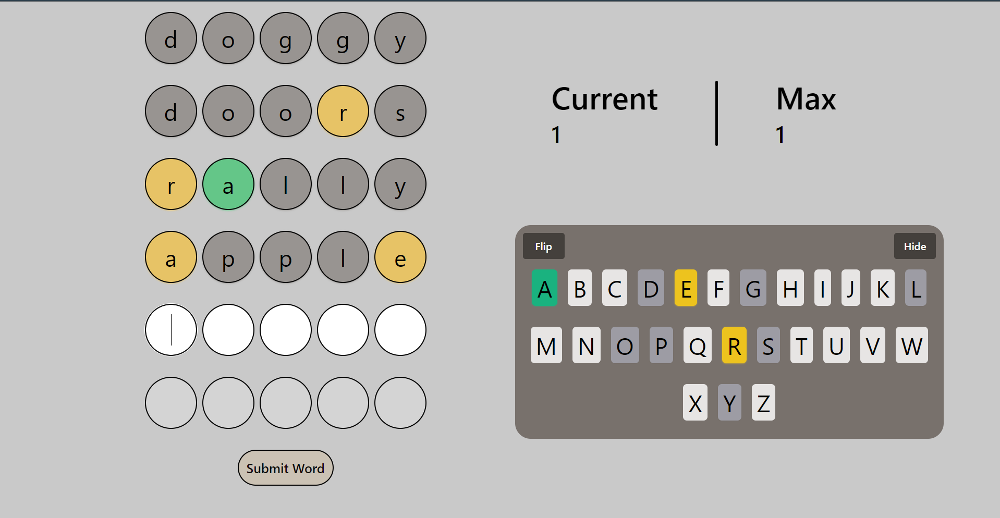

## Wordle Game Project
*This project is a JavaScript remake inspired by the game Wordle.*

### Description
This project aims to recreate the popular word-guessing game Wordle for the web using JavaScript. 
Players attempt to guess a randomly selected five-letter word within six attempts. 
Each correct letter guessed is indicated, with feedback on whether it's in the right position or not. 
The game runs entirely in the browser without page reloading, featuring user-friendly error messages 
to prevent invalid inputs such as numbers and submissions with fewer than five letters. Player scores, 
including the current streak and maximum streak achieved, are displayed throughout the game.
      
### Specs & Versions
| Category              | Type         |
|-----------------------|--------------|
| Langauge              | JavaScript   |
| CSS                   | Tailwind     |
| Deployment Frameworks | Vite & Vue   |

### Links
- [Plan](plan.md)
- [Wordnik API](https://developer.wordnik.com/)

